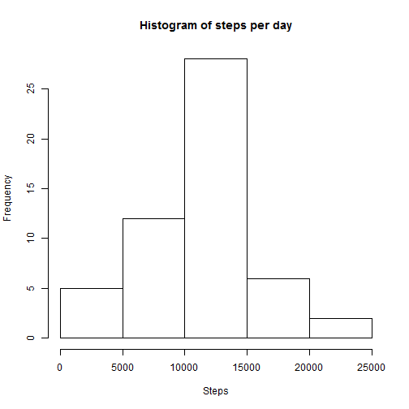
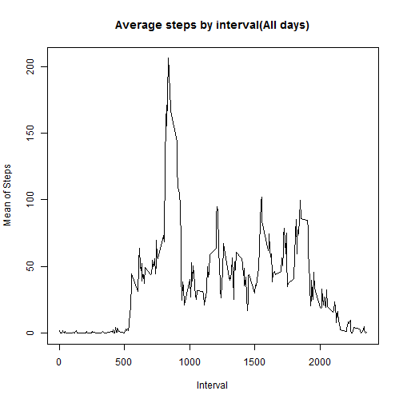
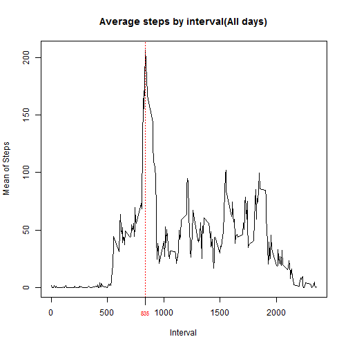
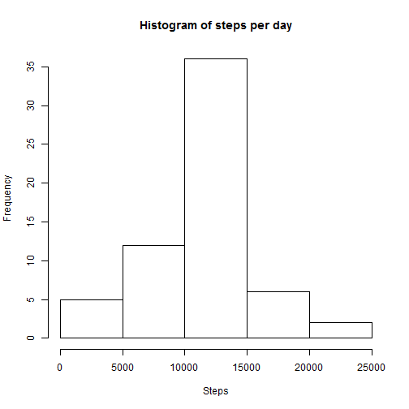
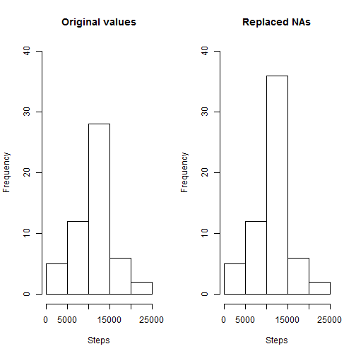
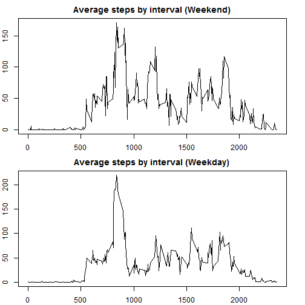

## Loading and preprocessing the data

Use the code bellow to unzip and read the data into a variable called "data"

```r
unzip("activity.zip")
data <- read.csv("activity.csv")
```

Now we will load the packages that we will use in the analysis  
We dont need to modify the data at this moment

```r
library(dplyr)
library(lubridate)
```

## What is mean total number of steps taken per day?

1- Calculate the total number of steps taken per day

```r
steps_by_day <- data %>% na.omit() %>% group_by(date) %>% summarise(steps = sum(steps))
```

2- If you do not understand the difference between a histogram and a barplot, research the difference between them. Make a histogram of the total number of steps taken each day

```r
hist(steps_by_day$steps, main = "Histogram of steps per day", xlab="Steps")
```

 

3- Calculate and report the mean and median of the total number of steps taken per day  


```r
steps_mean <- mean(steps_by_day$steps, na.rm = TRUE)
steps_median <- median(steps_by_day$steps, na.rm = TRUE)
steps_mean
```

```
## [1] 10766.19
```

```r
steps_median
```

```
## [1] 10765
```
The mean is: **1.0766189 &times; 10<sup>4</sup>**

The median is: **10765**  

## What is the average daily activity pattern?

1- Make a time series plot (i.e. type = "l") of the 5-minute interval (x-axis) and the average number of steps taken, averaged across all days (y-axis)

```r
steps_by_interval <- data %>% na.omit() %>% group_by(interval) %>% summarise(stepsMean = mean(steps))
plot(x = steps_by_interval$interval, y = steps_by_interval$stepsMean, 
     type = "l" , main = "Average steps by interval(All days)",
     ylab = "Mean of Steps",
     xlab = "Interval")
```

 

2- Which 5-minute interval, on average across all the days in the dataset, contains the maximum number of steps?

```r
top_interval_value <- filter(steps_by_interval, stepsMean == max(stepsMean)) %>% select(interval)
top_interval_value
```

```
## Source: local data frame [1 x 1]
## 
##   interval
## 1      835
```

The 5-minute that contains the maximum number of steps is: **835**  

We can plot a line that prove it:

```r
plot(x = steps_by_interval$interval, y = steps_by_interval$stepsMean, 
     type = "l" , main = "Average steps by interval(All days)",
     ylab = "Mean of Steps",
     xlab = "Interval")

abline(v = top_interval_value, col = "red", lty = 3)
axis(1, at=top_interval_value[[1]],labels=top_interval_value[[1]], col.axis="red", cex.axis=0.7, tck=-.03)
```

 

## Imputing missing values

1- Calculate and report the total number of missing values in the dataset (i.e. the total number of rows with NAs)

```r
total_na <- sum(!complete.cases(data))
total_na
```

```
## [1] 2304
```
    
The total number of NA is **2304**

2- Devise a strategy for filling in all of the missing values in the dataset. The strategy does not need to be sophisticated. For example, you could use the mean/median for that day, or the mean for that 5-minute interval, etc.

Here, we will take the mean by interval and use it for the missing values

```r
missing_data <- data[!complete.cases(data),]
for (i in 1:nrow(missing_data)){
    missing_data[i, 1] <- steps_by_interval %>% 
        filter(interval == missing_data[i,3]) %>% 
        select(stepsMean)    
}
```
    
After treatment, the total of missing data is: **0**

3- Create a new dataset that is equal to the original dataset but with the missing data filled in.

```r
df <- rbind(data[complete.cases(data),], missing_data)
```

4- Make a histogram of the total number of steps taken each day.


```r
steps_by_day_complete <- df %>% na.omit() %>% group_by(date) %>% summarise(steps = sum(steps))
hist(steps_by_day_complete$steps, main = "Histogram of steps per day", xlab="Steps")
```

 

* Calculate and report the mean and median total number of steps taken per day. 


```r
total_mean <- mean(steps_by_day_complete$steps, na.rm = TRUE)
total_median <- median(steps_by_day_complete$steps, na.rm = TRUE)
total_mean
```

```
## [1] 10766.19
```

```r
total_median
```

```
## [1] 10766.19
```

The new mean is: **1.0766189 &times; 10<sup>4</sup>** 

The new median is: **1.0766189 &times; 10<sup>4</sup>**  

* Do these values differ from the estimates from the first part of the assignment? What is the impact of imputing missing data on the estimates of the total daily number of steps?


```r
par(mfrow = c(1,2))
steps_by_day <- data %>% na.omit() %>% group_by(date) %>% summarise(steps = sum(steps))
hist(steps_by_day$steps, ylim = c(0, 40), xlab = "Steps", main = "Original values")

steps_by_day_complete <- df %>% na.omit() %>% group_by(date) %>% summarise(steps = sum(steps))
hist(steps_by_day_complete$steps, ylim = c(0, 40), xlab = "Steps", main = "Replaced NAs")
```

 

Since we used the mean by each interval for filling the missing data, we dont have a big impact on the data, the only thing that change was the frequency for the mean value in the new data and the mean now is equal to the median.

## Are there differences in activity patterns between weekdays and weekends?

1- Create a new factor variable in the dataset with two levels – “weekday” and “weekend” indicating whether a given date is a weekday or weekend day.

We will use the lubridate and dplyr package, that was already required to manipulate the data
    

```r
df$date <- ymd(df$date)
df <- mutate(df, weekday = 
                 ifelse(wday(date)  %in% c(1,2), 
                        yes = "weekend", 
                        no = "weekday"
            ))
df$weekday = as.factor(df$weekday)
```

2- Make a panel plot containing a time series plot (i.e. type = "l") of the 5-minute interval (x-axis) and the average number of steps taken, averaged across all weekday days or weekend days (y-axis).

Spliting the data for weekend and weekdays

```r
group_by_weekday <- df %>% select(steps, interval, weekday) %>% 
    group_by(weekday, interval) %>% summarise(steps = mean(steps))

dfWeekend <- filter(group_by_weekday, weekday == "weekend")
dfWeekday <- filter(group_by_weekday, weekday == "weekday")
```
    
Plotting the data

```r
par(mfcol = c(2, 1), mar=c(2, 2, 2, 2) + 0.1)
plot(x = dfWeekend$interval, y = dfWeekend$steps, 
     type = "l" , main = "Average steps by interval (Weekend)")
plot(x = dfWeekday$interval, y = dfWeekday$steps, 
     type = "l" , main = "Average steps by interval (Weekday)")
```

 
