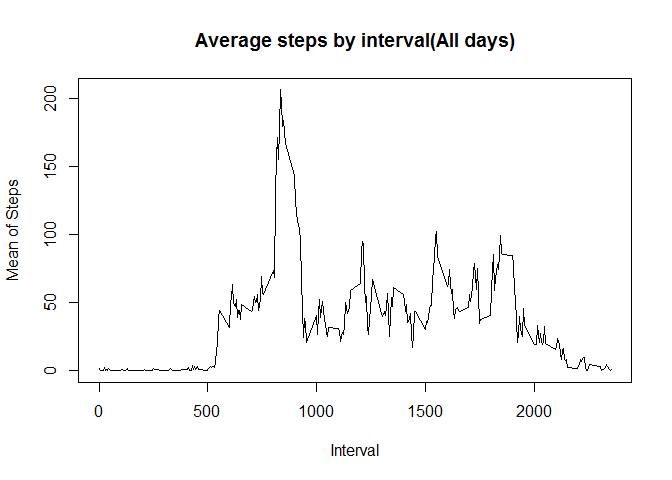
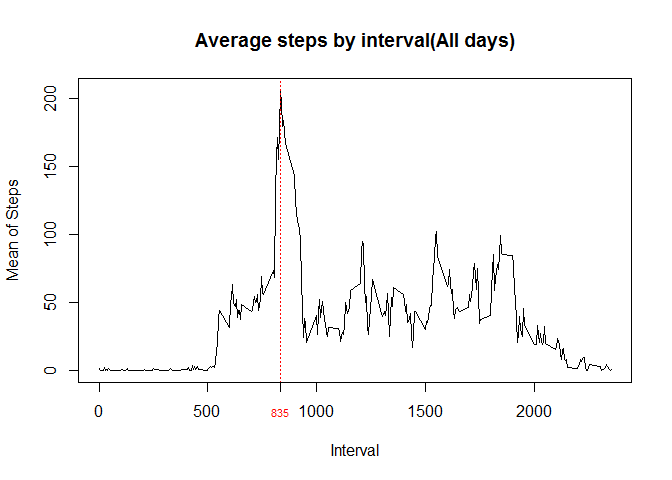

# Reproducible Research: Peer Assessment 1


## Loading and preprocessing the data

Use the code bellow to unzip and read the data into a variable called "data"

```r
unzip("activity.zip")
data <- read.csv("activity.csv")
```

Now we will load the packages that we will use in the analysis  
We dont need to modify the data at this moment

```r
library(dplyr)
library(lubridate)
```

## What is mean total number of steps taken per day?

1. Calculate the total number of steps taken per day

```r
steps_by_day <- data %>% na.omit() %>% group_by(date) %>% summarise(steps = sum(steps))
```

2. If you do not understand the difference between a histogram and a barplot, research the difference between them. Make a histogram of the total number of steps taken each day

```r
hist(steps_by_day$steps, main = "Histogram of steps per day", xlab="Steps")
```

 

3. Calculate and report the mean and median of the total number of steps taken per day  


```r
steps_mean <- mean(steps_by_day$steps, na.rm = TRUE)
steps_median <- median(steps_by_day$steps, na.rm = TRUE)
steps_mean
```

```
## [1] 10766.19
```

```r
steps_median
```

```
## [1] 10765
```
The mean is: 1.0766189\times 10^{4}  

The median is: 10765  

## What is the average daily activity pattern?

1. Make a time series plot (i.e. type = "l") of the 5-minute interval (x-axis) and the average number of steps taken, averaged across all days (y-axis)

```r
steps_by_interval <- data %>% na.omit() %>% group_by(interval) %>% summarise(stepsMean = mean(steps))
plot(x = steps_by_interval$interval, y = steps_by_interval$stepsMean, 
     type = "l" , main = "Average steps by interval(All days)",
     ylab = "Mean of Steps",
     xlab = "Interval")
```

 

2. Which 5-minute interval, on average across all the days in the dataset, contains the maximum number of steps?

```r
topIntervalValue <- filter(steps_by_interval, stepsMean == max(stepsMean)) %>% select(interval)
topIntervalValue
```

```
## Source: local data frame [1 x 1]
## 
##   interval
## 1      835
```

The 5-minute that contains the maximum number of steps is: 835  

We can plot a line that prove it:

```r
plot(x = steps_by_interval$interval, y = steps_by_interval$stepsMean, 
     type = "l" , main = "Average steps by interval(All days)",
     ylab = "Mean of Steps",
     xlab = "Interval")

abline(v = topIntervalValue, col = "red", lty = 3)
axis(1, at=topIntervalValue[[1]],labels=topIntervalValue[[1]], col.axis="red", cex.axis=0.7, tck=-.03)
```

 

## Imputing missing values

1. Calculate and report the total number of missing values in the dataset (i.e. the total number of rows with NAs)

```r
totalNA <- sum(!complete.cases(data))
totalNA
```

```
## [1] 2304
```

The total number of NA is 2304

## Are there differences in activity patterns between weekdays and weekends?
